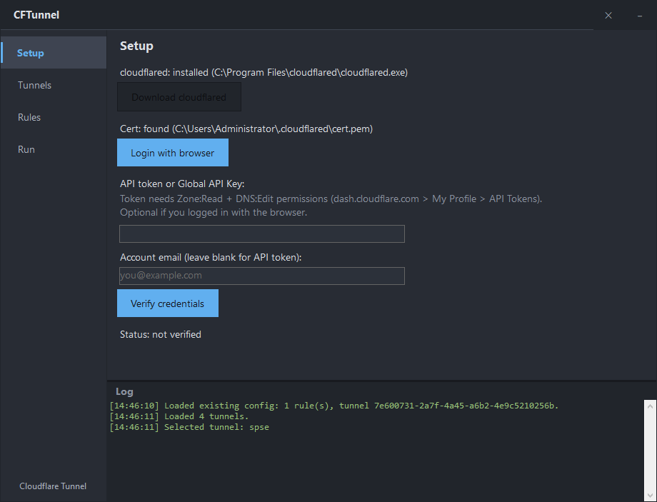
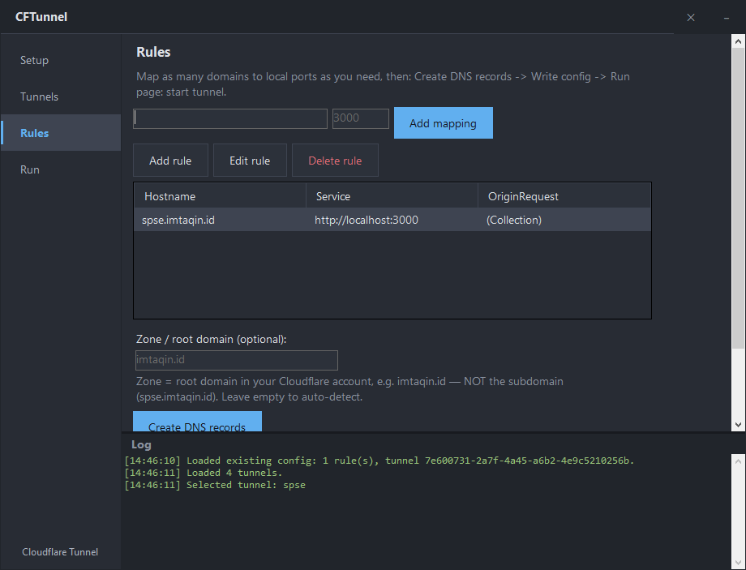
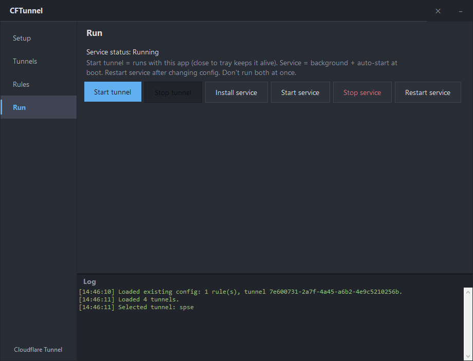

# CFTunnel

Windows GUI for managing Cloudflare Tunnels. No config files to hand-write, no CLI commands to memorize.



| Rules | Run |
|---|---|
|  |  |

## What it does

- Download and set up cloudflared automatically
- Login with browser (cert.pem) or API token
- Create, select, and delete tunnels
- Map multiple domains to multiple local ports in one tunnel
- Create DNS records automatically (tries `cloudflared tunnel route dns` first, falls back to Cloudflare API)
- Write config.yml for you
- Run tunnel in foreground or install as Windows service
- Minimize to tray, tunnel keeps running
- Remembers your config, API token (DPAPI encrypted), and rules between launches

## Install

Download the MSI from [Releases](https://github.com/imtaqin/CloudfFlare-Tunnel-GUI/releases) and run it. Self-contained, no .NET runtime needed.

## Usage

1. **Setup** - login with browser, or paste an API token (needs Zone:Read + DNS:Edit)
2. **Tunnels** - create a tunnel or select an existing one
3. **Rules** - type hostname + local port, click Add mapping. Repeat for every domain you want
4. Click **Create DNS records**, then **Write config**
5. **Run** - start tunnel, or install it as a Windows service so it survives reboots

## Build from source

Requires .NET 10 SDK.

```
dotnet build CFTunnel/CFTunnel.csproj -c Release
```

Build the installer (requires WiX v5):

```
dotnet publish CFTunnel/CFTunnel.csproj -c Release -r win-x64 --self-contained -p:PublishSingleFile=true -o publish
wix build installer/CFTunnel.wxs -arch x64 -o installer/CFTunnel.msi
```

## License

MIT
